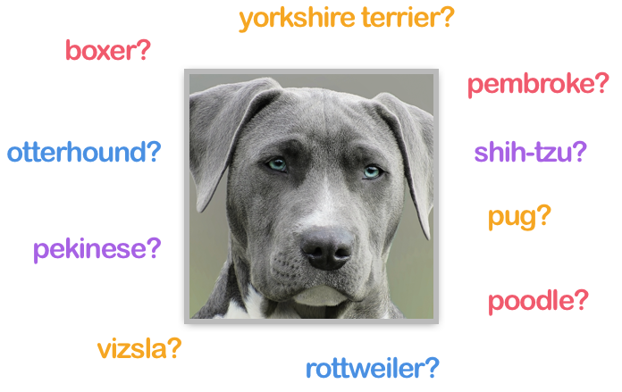
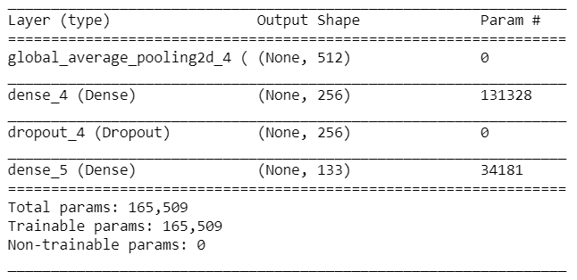
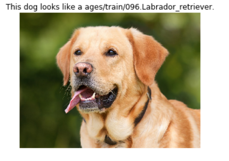
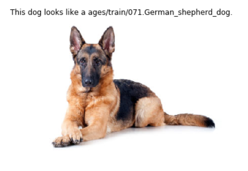

# Dog Classifier



## Introduction

As part of this project, I built and trained a neural network model using converged neural networks (CNN), using 8,351 photos of 133 dog breeds. CNN is a type of deep neural network commonly used to analyze image data. Typically, CNN architecture includes convolutional layers, activation function, cluster layers, fully connected layers, and normalization layers. Transfer learning is a technique that allows you to reuse a model developed for one task as a starting point for another task.

A trained model can be used by a web or mobile application to process realistic images provided by the user. When you give a picture of a dog, the algorithm predicts the breed of the dog. If a human image is provided, the code will identify the most similar dog breeds.

This article will describe the technical aspect of this project from start to finish.

## Load Datasets

The full dataset used by this project contains 8,351 images of 133 categories of dogs. The data is separated into three folders for training, validation, and test set. The load_files function from the scikit-learn library is used to import the datasets.

```python
from sklearn.datasets import load_files
from keras.utils import np_utils
import numpy as np
from glob import glob
import numpy as np
import cv2

# define function to load train, test, and validation datasets
def load_dataset(path):
    data = load_files(path)
    dog_files = np.array(data['filenames'])
    dog_targets = np_utils.to_categorical(np.array(data['target']), 133)
    return dog_files, dog_targets

# load train, test, and validation datasets
train_files, train_targets = load_dataset('../../../data/dog_images/train')
valid_files, valid_targets = load_dataset('../../../data/dog_images/valid')
test_files, test_targets = load_dataset('../../../data/dog_images/test')
```

## Detect Humans

Since we want to identify the most resembling dog breed for a person, a function needs to be written to detect whether a human face exists in an image. This project used a pre-trained face detector provided by OpenCV. Please note that the input image is converted to grayscale before it is fed into the face cascade classifier.

```python
import cv2
# Extract pre-trained face detector
face_cascade = cv2.CascadeClassifier('haarcascades/haarcascade_frontalface_alt.xml')

def face_detector(img_path):
    img = cv2.imread(img_path)
    gray = cv2.cvtColor(img, cv2.COLOR_BGR2GRAY)
    faces = face_cascade.detectMultiScale(gray)
    return len(faces) > 0
```

## Detect Dogs

Similarly, a dog detector function is needed to determine whether there is actually a dog in the input image. A pre-trained Resrnet50 model is used in this project to detect dogs in images.

```python
from keras.applications.resnet50 import ResNet50
# define ResNet50 model
ResNet50_model = ResNet50(weights='imagenet')
```

Keras CNNs require input images to be converted into 4D tensors, so some pre-processing is needed for the image data.

```python
from keras.preprocessing import image
from tqdm import tqdm

def path_to_tensor(img_path):
    # loads RGB image as PIL.Image.Image type
    img = image.load_img(img_path, target_size=(224, 224))
    # convert PIL.Image.Image type to 3D tensor with shape (224, 224, 3)
    x = image.img_to_array(img)
    # convert 3D tensor to 4D tensor with shape (1, 224, 224, 3) and return 4D tensor
    return np.expand_dims(x, axis=0)

def paths_to_tensor(img_paths):
    list_of_tensors = [path_to_tensor(img_path) for img_path in tqdm(img_paths)]
    return np.vstack(list_of_tensors)
```

The ResNet50_predict_labels function takes an image path as input, and returns the predicted label of that image using the pre-trained ResNet50 model. The ResNet50 dictionary shows that labels between 151 and 268 are all dogs, therefore the dog_detector function can take advantage of this logic to determine whether the input image contains a dog.

```python
from keras.applications.resnet50 import preprocess_input, decode_predictions

def ResNet50_predict_labels(img_path):
    # returns prediction vector for image located at img_path
    img = preprocess_input(path_to_tensor(img_path))
    return np.argmax(ResNet50_model.predict(img))

def dog_detector(img_path):
    # Detect if an image has a dog or not
    prediction = ResNet50_predict_labels(img_path)
    return ((prediction <= 268) & (prediction >= 151))
```

## CNN to Classify Dog Breeds using Transfer Learning

The full dataset has 8,351 dog images, which is not large enough to train a deep learning model from scratch. Therefore, transfer learning with VGG-19 ( a convolutional neural network that is trained on more than a million images from the ImageNet database) is used to achieve relatively good accuracy with less training time.

### Bottleneck Features

The bottleneck features for the VGG-19 network were pre-computed , and then imported for later use by the transfer learning model.

```python
bottleneck_features = np.load('/data/bottleneck_features/DogVGG19Data.npz')
train_VGG19 = bottleneck_features['train']
valid_VGG19 = bottleneck_features['valid']
test_VGG19 = bottleneck_features['test']
```

### Model Architecture

The last convolutional output of VGG-19 is fed as input to the model. We only need to add a global average pooling layer and fully connected layers as dog classifiers.

I added Global Average Pooling and two fully connected layers for better accuracy, and a dropout layer to prevent over-fitting.

```python

from keras.layers import Dropout, Dense, GlobalAveragePooling2D
from keras.models import Sequential

VGG19_model = Sequential()
VGG19_model.add(GlobalAveragePooling2D(input_shape=train_VGG19.shape[1:]))
VGG19_model.add(Dense(256, activation='relu'))
VGG19_model.add(Dropout(0.2))
VGG19_model.add(Dense(133, activation='softmax'))

VGG19_model.summary()
```

The architecture of the model :



### Model Metric

Accuracy is chosen as the metric to evaluate the model performance. Since data is just slightly imbalanced, accuracy should be a proper metric to select a good model

### Train Model

The model is trained using the pre-computed bottleneck features as input. A model check pointer is used to keep track of the weights for best validation loss. When all epochs are finished, the model weights with the best validation loss are loaded into the VGG19_model, which will be used later for predictions.

The model was trained for 25 epochs using ```categorical crossentropy``` as loss function and ```rmsprop``` as optimizer

```python

VGG19_model.compile(loss='categorical_crossentropy', optimizer='rmsprop', metrics=['accuracy'])

checkpointer = ModelCheckpoint(filepath='saved_models/weights.best.VGG19.hdf5',
                               verbose=1, save_best_only=True)

VGG19_model.fit(train_VGG19, train_targets,
          validation_data=(valid_VGG19, valid_targets),
          epochs=25, batch_size=32, callbacks=[checkpointer], verbose=1)
```

### Making Predictions

Finally, it is ready to make predictions. The ```VGG19_predict``` function takes an image path as input, and returns the predicted dog breeds. The ```dog_breed_pred``` function is built on the previous one, and returns predicted results depending on whether a dog or a human is detected in the input image.

```python
from extract_bottleneck_features import *

def VGG19_predict(img_path):
    # extract bottleneck features
    bottleneck_feature = extract_VGG19(path_to_tensor(img_path))
    # obtain predicted vector
    predicted_vector = VGG19_model.predict(bottleneck_feature)
    # return dog breed that is predicted by the model
    return dog_names[np.argmax(predicted_vector)]
  
def dog_breed_pred(path):
    # Detect dog or human and run prediction
    if dog_detector(path):
        dog_breed = VGG19_predict_breed(path)
        result = 'This dog looks like a ' + dog_breed + '.'
    elif face_detector(path):
        resemb_dog_breed = VGG19_predict_breed(path)
        result = 'The most resembling dog breed of this person is ' + resemb_dog_breed + '.'
    else:
        result = 'There is no human or dog detected in this picture.'
    return result
```

## Results

The accuracy of the final model on test dataset is about 72.9665%%, which is not bad. Originally, I trained a CNN model from scratch without using Transfer Learning, the accuracy was only 15.3110%. Then, I created a CNN model using transfer learning and VGG-19 with Global Average Pooling and only one fully connected layer, and was able to reach an accuracy of about 53%. Finally, I added a second fully connected layer to the classifier, and was able to achieve 73% accuracy.

When given an image of a dog, the final model predicts the dog breed. For example,





If a human is in the input image, it identifies the most resembling dog breed based on the person’s face.


When the image does not contain a human or a dog, it will tell you that there is no human or dog detected. For example,


## Conclusion

Thanks to the transfer learning technique, I was able to train a model with relatively small dataset, and achieved pretty good accuracy. In addition, the model was trained within a short period of time, which is quite efficient. The main reason is we can reuse the weights trained by machine learning experts using millions of images.

The initial model was a CNN from scratch, which did not work well. It only reached an accuracy of 15.3110%.I think it is because the size of dataset is relatively small, and the model architecture might not be well designed.

There are a few possible improvements for the model. First, the parameters of fully connected layers, such as number of layers, number of nodes, dropout percentages, might be tweaked to get better results. Second, using a different optimizer or evaluation metric may also improve model performance. Third, data augmentation could also improve the final model accuracy, as it will generate more training data.
